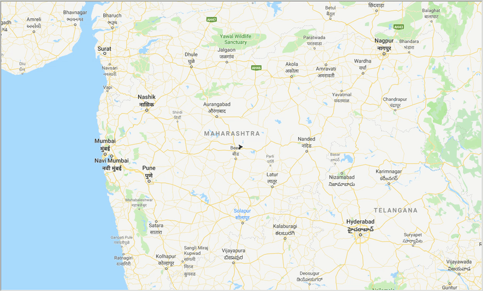

## Traveling Salesman Problem using Ant Colony Optimization

### Introduction
##### Ant Colony Optimization
Ant colony optimization (ACO) is a meta-heuristic technique in the field of swarm intelligence. It is use for solving different combinatorial optimization problems.

ACO is based on the behaviors of ant colony and their  search capability for combinatorial optimization. Analysis of natural behavior of ant colonies show that the ants move along the rich pheromone distribution on their path. The algorithm imitates this behavior.

##### Traveling Salesman Problem
The Traveling Salesman Problem (TSP) is a classic algorithmic problem focused on optimization.

> A better solution often means a solution that is cheaper, shorter, or faster.

The problem describes a salesman who must travel between `N` cities such that he visits each city once during his trip. Each city is connected to the other cities and the links have fixed weights (travel costs, distance etc.)

### Dataset
The dataset consists of 225 cities in the North-West and Central part of the Indian sub continent.

##### Dataset structure
```
tsp dataset/
    ├── distance.txt
    ├── location_ll.txt
    ├── location_map.jpg
    ├── location_map_satellite_image.jpg
    ├── names.txt
    ├── road_distance.txt
    └── travel_time.txt
```

##### File description
|      **File**     |                            **Description**                           |
|:-----------------:|:--------------------------------------------------------------------:|
|  location_ll.txt  | Space separated Geo locations (latitude and longitude) of each city. |
|    distance.txt   | Eucledian distance between the cities.                               |
| road_distance.txt | Distance by road between the cities.                                 |
|  travel_time.txt  | Time take to travel from one city to another.                        |

### Algorithms
##### Ant Colony System
In Ant Colony System (ACS), a number of artificial ants are initially placed at random cities. Each ant builds a tour (a feasible solution of the TSP). It chooses the next city by applying a *state transition rule* (greedy rule). This rule provides a balance between exploration of new edges and exploitation of accumulated knowledge.

> A constant amount of pheromone is deposited by each ant at each step on the most favorable route (best tour)

##### Elitist
Using the Elitist approach, we try to control the learning parameters. The ants that find the best route (quality) are rewarded more that the other ants. More pheromone is deposited on better routes, giving importance to that particular tour and reducing the time to get an optimal solution.

> The amount of pheromone deposited in based on the quality of the route. 

##### MaxMin
The MaxMin method aims to get the best of both worlds, a close to optimal solution with a quick execution time. This is achieved by varying the amount to pheromone deposited through the steps. 

Initially the weight is high, giving a quick learning rate. The weight gradually decreases till 75% completion. Then the model if fine tuned by applying weights by comparing the results to the *global best tour*.

At the end of each step, the weights are bound within the max and min pheromone limits to prevent the solution to running astray.

> The amount of pheromone gradually decreases for the first 75% of iterations. Then amount depends on the quality compared to the best tour.

##### Parameters

```py
params = {
    '_colony_size': "number of ants in the colony"  (default = 15),
    '_steps': "iteration to run through" (default = 50),
    '_mode': "mode of algorithm to run the model"
}
```

##### Usage

```py
# Import model
from aco_tsp import SolveTSPUsingACO

# Setup parameters
_colony_size = 15
_steps = 50

# Select mode
# ['ACS', 'Elitist', 'MaxMin']
_mode = 'ACS'

# Nodes (latitude and longitude)
_nodes = [(20.05961, 77.949783), (17.075451, 74.628664), ..., (19.4133545, 80.0059101)]
s
# Model setup and run
model = SolveTSPUsingACO(
    mode = _mode,
    colony_size = _colony_size,
    steps = _steps,
    nodes = _nodes
)

runtime, distance = model.run()
```

### Result
With the help of ACO, we generate an optimal path to cover all the cities while trying to minimize the travel distance. Also the result depends on the parameters of the algorithm and the edge weights `(travel time, distance, road_distance)` used to optimize the path.

<p align="center">
  <br>
  <i><b>Figure:</b> Trace of Optimal Path through the cities</i>
</p>